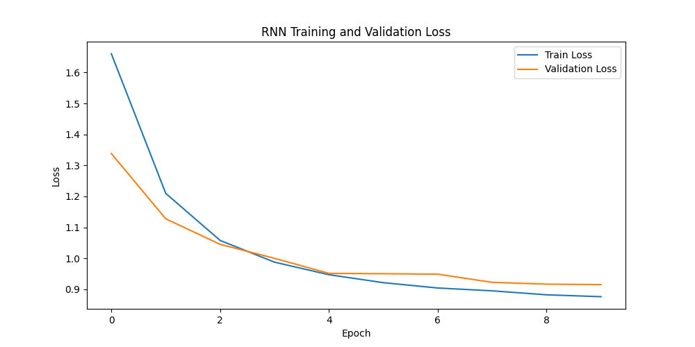

# Language Model
### 과목: 인공지능과 딥러닝
### 과제: 문자 수준 언어 모델링을 위한 신경망 작업
### 기한: 2024. 05. 26. 일 23:59
### 이름: 문혜정
### 학번: 23620026

1. `dataset.py`: 모델에 데이터를 제공하기 위한 파이프라인 직접 작성
       1. 파이프라인 구성 단계와 코드 매핑
            1. **데이터 로드 및 전처리**:
                - `dataset.py` 파일의 `__init__` 메서드
            2. **Dataset 초기화**:
                - `dataset.py` 파일의 `__init__` 메서드
                - `main.py` 파일의 `dataset = Shakespeare('shakespeare_train.txt')`
            3. **DataLoader 생성**:
                - `main.py` 파일의 `train_loader`와 `val_loader`
            4. **모델 학습 루프**:
                - `main.py` 파일의 `train_loss = train(model, train_loader, device, criterion, optimizer)`
                - `main.py` 파일의 `train` 함수 정의
            5. **모델 검증 루프**:
                - `main.py` 파일의 `val_loss = validate(model, val_loader, device, criterion)`
                - `main.py` 파일의 `validate` 함수 정의
            6. **최적 모델 저장**:
                - `main.py` 파일의 `torch.save(model.state_dict(), 'best_rnn_model.pth' if model_type == 'RNN' else 'best_lstm_model.pth')`
2. `model.py` : 모델 성능 향상을 위한 레이어 변경, GPU사용
        1. GPU 사용 설정: device를 설정하여 모델과 데이터를 GPU로 이동: torch.device('cuda' if torch.cuda.is_available() else 'cpu')
        2. 모델과 데이터의 GPU로 이동: 모델을 초기화할 때와 데이터를 생성할 때 .to(device)를 사용하여 GPU에서 계산이 이루어지도록 슺ㅇ
        3. 은닉 상태 초기화: 은닉 상태를 초기화할 때 .to(device)를 사용하여 GPU에서 계산
        4. 모델 크기 조정: hidden_size를 128에서 256으로, num_layers를 2에서 3으로 증가시켜 모델의 표현력 증가
        5. 배치 크기 증가: batch_size를 32에서 64로 증가시켜 GPU의 활용률 향상
    3. `main.py` : 모델 훈련-학습 및 검증 데이터 세트의 평균 손실 값을 사용하여 학습 프로세스를 모니터링.
        1. 학습 손실 값 계산 및 출력(for batch_idx, (inputs, targets) in enumerate(trn_loader)): train 함수에서 각 배치의 손실 값을 계산하고 출력. 에포크가 끝날 때 전체 학습 데이터에 대한 평균 손실 값을 반환
        2. 검증 손실 값 계산 및 출력(with torch.no_grad()): validate 함수에서 각 배치의 손실 값을 계산하고 출력. 에포크가 끝날 때 전체 검증 데이터에 대한 평균 손실 값을 반환
        3. 에포크 시작 시 출력 및 학습 및 검증 손실 값 저장(for epoch in range(num_epochs)): 각 에포크의 시작을 출력하고 train 함수와 validate 함수에서 반환 된 평균 손실 값을 저장
        4. 최상의 검증 손실 값에 따른 모델 저장(if val_loss < best_val_loss): 검증 손실 값이 가장 낮을 때 모델의 상태를 저장
        5. 학습 및 검증 손실 값 플롯: plot_losses 함수를 사용하여 학습 및 검증 손실 값을 플롯
    4. (report) 학습과 검증의 평균 손실값을 플롯하여 검증 데이터 세트에 대한 손실값을 기준으로 바닐라 RNN과 LSTM의 언어 생성 성능을 비교.
        1. 평균 손실 값 그래프
           
        2. RNN과 LSTM의 언어 생성 성능을 비교: 학습 초기에는 Traning의 Loss가 크지만, 학습을 에포크 4단계 이후부터는 Validation 의 Loss가 크게 나타남
        
    5. [`generate.py`](http://generate.py) 로 학습된 모델로 문자 생성: 가장 우수한 유효성 검사 성능을 보이는 모델을 선택하여 서로 다른 seed 문자로부터 생성된 5가지 길이의 샘플을 최소 100개 이상 제공
        1. A부터 Z사이의 문자 중 랜덤으로 5개 문자 선정:  seed_characters_list = [''.join(random.choice(string.ascii_uppercase) for _ in range(5)) for _ in range(5)]
        2. 5개의 문자를 기준으로 문자 200개씩 생성
        3. 생성된문장을 generate{햔재시분초}.txt로 저장
    6. (report) 온도 매개변수가 있는 Softmax 함수 T를 이용해 캐릭터를 생성: 캐릭터를 새성할 때 다양한 온도를 시도해보고 온도에 따라 어떤 차이가 있는지, 왜 더 그럴듯한 결과를 생성하는 데 도움이 되는지 토론
        1. **온도 매개변수를 사용한 Softmax 적용**
            1. **`output.squeeze().div(temperature).exp()`**를 사용하여 온도 매개변수를 적용
            2. **`F.softmax(output, dim=-1).cpu()`**를 사용하여 소프트맥스 함수로 확률 분포를 계산
        - 온도 매개변수를 다양하게 설정: 온도 T로 여러 값을 시도하면, 모델이 생성하는 텍스트의 다양성과 일관성을 관찰 가능하다. 일반적으로 사용되는 온도 값은 0.5, 1.0, 1.5 등이다. 온도 값이 낮으면 모델이 더 예측 가능하고 일관성 있는 출력을 생성하며, 온도 값이 높으면 더 창의적이고 다양성 있는 출력을 생성하는 것을 확인할 수 있다.
        
    ※ 온도차이별 캐릭터 생성을 검증하기 위해 이야기에 나오는 주인공 5명 MARCIUS, BRUTUS, SICINIUS, CORIOLANUS, MENENIUS 을 중심으로 문자 200개씩 생성한 경우: generate_acters.txt
        
